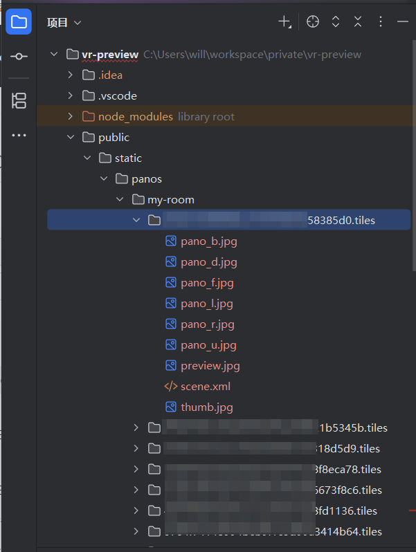
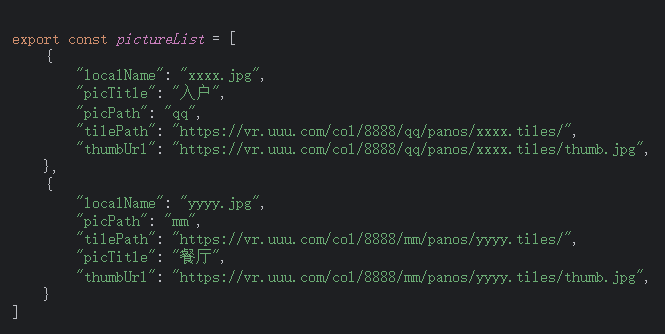
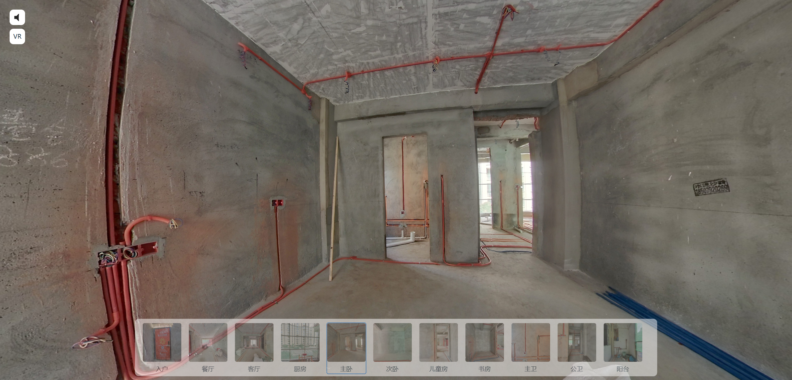

# VR 预览

日丰现在提供VR浏览记录管线位置服务，通常是在水电完成后日丰的人来拍摄，之后直接发一个链接给我取浏览,但是日丰的这个服务也不知道提供多久，又没有源文件，怕过期，所以我自己搭建了一个VR预览的服务，把日丰的VR图片下载下来放到我的服务里。

在命令行进入当前项目的目录下，执行以下命令来下载日丰的VR图片
```
cd public/vr-3d_rifeng_download
pnpm install
node down.js
```
下载完成后的图片位置在 `public/static/panos`

我直接在电脑端抓取到了日丰的VR浏览的接口数据，根据数据结构自行写了代码下载，数据结构如下，请自行替换或根据接口数据结构去重写down.js的逻辑


回到项目根目录下安装依赖运行项目
```
pnpm install
pnpm run dev
```

